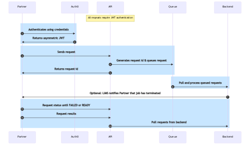

# API Prototype

This directory contains a sketch of an API service and client that demonstrates:

- Using API-first design using OpenAPI 3.0
- Using either self-issued or Auth0-issues JSON Web Tokens
- Implementing in Python using Connexion, Flask, and gunicorn for production

The rough use case is an API for machine-to-machine integration between two companies, a Provider and a Client.

## Flow Overview

* The Client authenticates at Auth0 using a client secret to obtain a
  JWT. The JWT is signed using a private key. The Client presents the
  JWT to this API for all requests, which validates the JWT using the
  public key.  The intended architectural pattern is to centralize
  authn/z services away from the API itself.

  Alternatively, the Client can fetch a JWT from the /auth endpoint.

* When the API receives a request, it is validated and queued, and a
  request id is returned to the Client. In the real world, this
  request would be queued in AWS SQS, ZeroMQ, Redis, or similar
  high-availability service. In this prototype, the request is stored 
  in a dictionary.
  
* A client later request status using the request_id. In this implementation,
  a request passes through stages after fixed periods of time.

## Installation

### Auth0 Setup

You are free to use the Auth0 setup in client/config.yaml.  However, if you want to do this yourself, here are the brief steps:

- Create an account at Auth0
- Under Applications > API, create an API called "api-prototype".
- Under Applications > Applications, you'll see "api-prototype (Test Application)".  Click
  the ⋯ at right, select Settings. Copy the domain, id and secret into client/config.yaml.
- Under Settings > Signing Keys, download your current key (see the ⋯ menu at right).
  Extract the public key with `openssl x509 -pubkey -in your-cert.pem`. Put the public key into service/config.yaml.

### Python Environment Setup

For simplicity, we'll create a single virtual env for the service and the client.  (In practice, these would be on different machines and different environments, of course.)

    python3 -m venv venv
    source venv/bin/activate
    pip install -U setuptools pip
    pip install -r service/requirements.txt -r client/requirements.txt

### Starting the Service

In a new terminal:

    source venv/bin/activate
    cd service
    python3 app.py

Then go to http://localhost:8080/ui/ (note the /ui suffix).

### Trying the Client Notebook

The swagger UI works great as a client. You can also use Postman. Here, we'll use a Jupyter notebook.  In a new terminal:

    source venv/bin/activate
    cd client
    jupyter notebook client.ipynb

A new browser window should open. Follow along with the notebook.  If you make the service window visible, you should see service log messages during your client session.

# Docker and Production Deployment

    gunicorn --access-logfile=-  app:app

